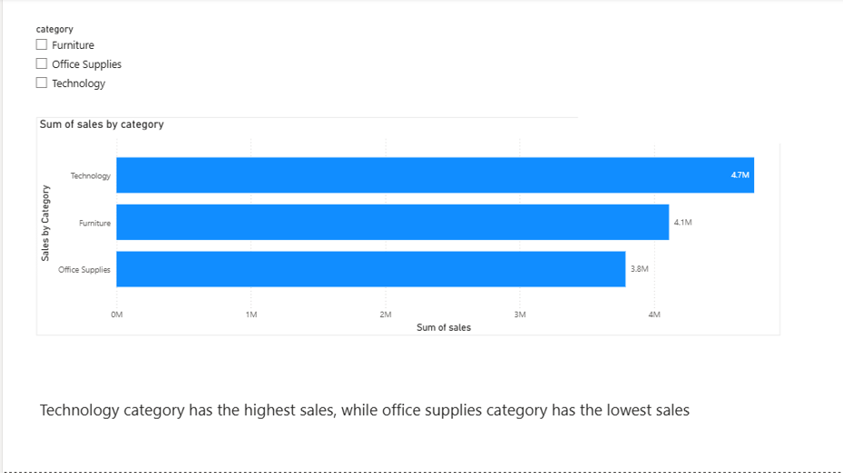
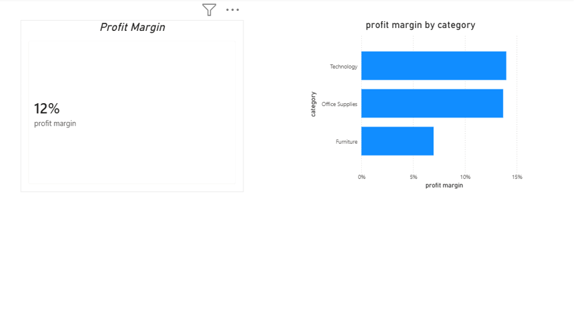
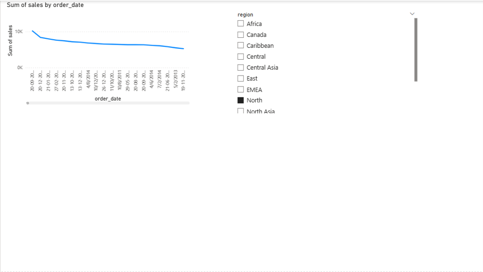
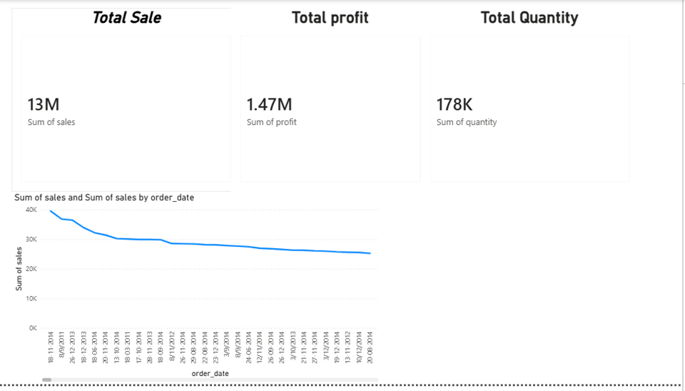

# 📊 Sales Analysis Dashboard (Power BI + SQL)

## 📌 Project Overview
This project focuses on analyzing sales data to generate meaningful business insights. The dashboard is built using Power BI, and SQL is used for data analysis and querying.

The objective is to understand sales performance across categories, regions, and time to support data-driven decision-making.

---

## 🛠️ Tools & Technologies
- Power BI (Dashboard & Visualization)
- SQL (Data Analysis)
- Excel / CSV (Dataset)

---

## 📊 Dashboard Features
- KPI Cards: Total Sales, Total Profit, Total Quantity, Profit Margin  
- Bar Charts:
  - Sales by Category  
  - Profit by Region  
- Line Chart:
  - Sales Trend over Time  
- Slicer:
  - Region filter for interactive analysis  
- Insight Section:
  - Key business findings highlighted  

---

## 📈 Key Insights
- Technology category is the top-performing segment in terms of both sales and profit.  
- Office Supplies category shows the lowest performance.  
- Sales trend fluctuates over time, with peak in November and lowest in August.  
- Profit margin helps evaluate overall business efficiency.  

---

## 💡 Learnings
- Built interactive dashboards using Power BI  
- Performed data analysis using SQL  
- Understood key business metrics like sales, profit, and profit margin  
- Improved dashboard design and data storytelling skills  

---

## 📷 Dashboard Preview
### 🔹 Sales by Category

### 🔹 Profit Margin Analysis

### 🔹 Sales by Region

### 🔹 Product Sales Analysis

---

## 📂 Files Included
- Dataset (CSV)  
- Power BI Dashboard (Sales_analysis_dashboard.pbix)  

---

## 🎯 Conclusion
This project demonstrates my ability to analyze data, build dashboards, and communicate insights effectively.
